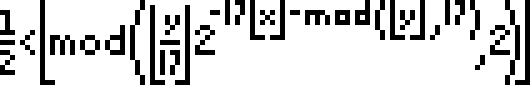

# Tupper

This is a javascript implementation of Tupper's formula.
A formula that visually represents itself when graphed at a specific location in the (x, y) plane.



## Install

**On NPM:**

```sh
npm install tupper --save
```

**On browser:**

> download the web version at [dist/tupper.web.min.js](dist/tupper.web.min.js) or use de CDN:

```html
<script src="https://cdn.rawgit.com/filipemeneses/tupper/b17885ae/dist/tupper.web.min.js" charset="utf-8"></script>
```


## Usage

On NPM:

```js
const tupper = require('tupper')
```

On browser will be available as `tupper`.

### toGraph(Number)

This method will convert a integer to an array of 0 and 1

```js
var invader = '356190145855031919348890157738898011538149755602338030'
var pixels = tupper.toGraph(invader)
```

Which can later be used to print into a canvas:


### toNumber(Array)

This method will convert an array of 0 and 1 into Tupper's decimal


```js
var pixels = tupper.toNumber([[0,0,0,0,0,0, ...)
```

Which can later be used to print into a canvas:

```
4858450636189713423582095962494202044581400587983244549483093085061934704708809928450644769865524364849997247024915119110411605739177407856919754326571855442057210445735883681829823754139634338225199452191651284348332905131193199953502413758765239264874613394906870130562295813219481113685339535565290850023875092856892694555974281546386510730049106723058933586052544096664351265349363643957125565695936815184334857605266940161251266951421550539554519153785457525756590740540157929001765967965480064427829131488548259914721248506352686630476300
```


## References

- http://tuppers-formula.tk/
- https://en.wikipedia.org/wiki/Tupper%27s_self-referential_formula
